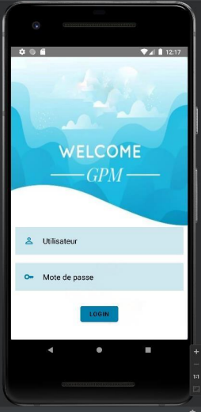
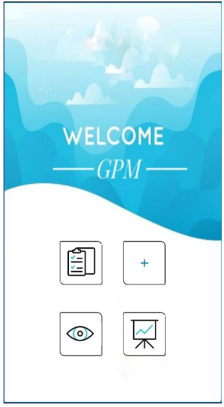
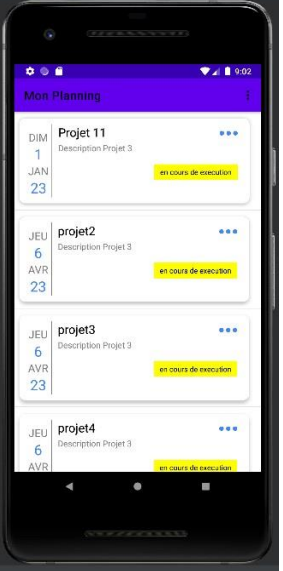
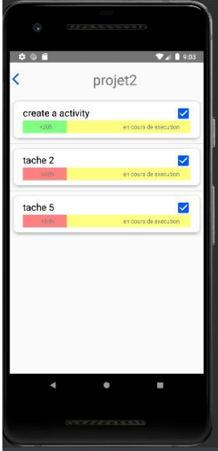
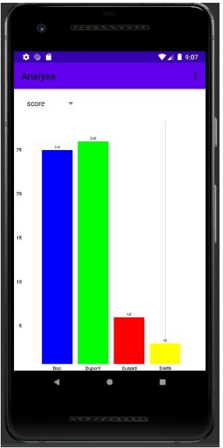
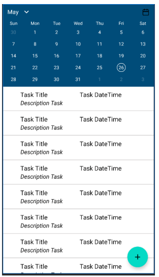
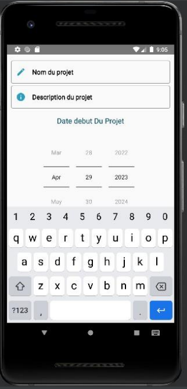

# Material_Management
This repository is the client (front) part of the Material_Management_api project, if you want to see the API part, it is in the Material_Management_api repository.
## Graphical Interface Mockups:
### Authentication Interface:

### Home Interface:

### Planning Interface:

### Task Interface:

### Score Analysis Interface:

### Visualization Interface:

### Add Project Interface:

